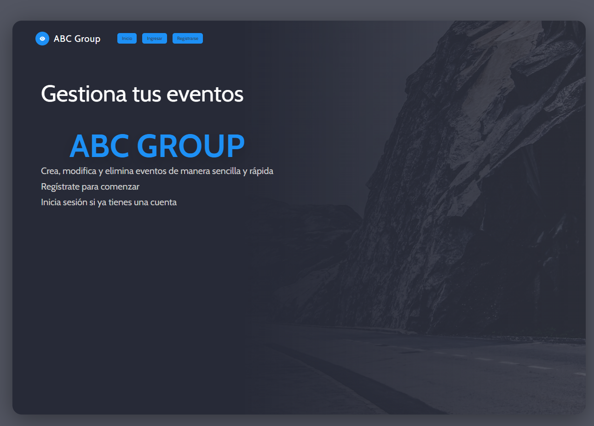
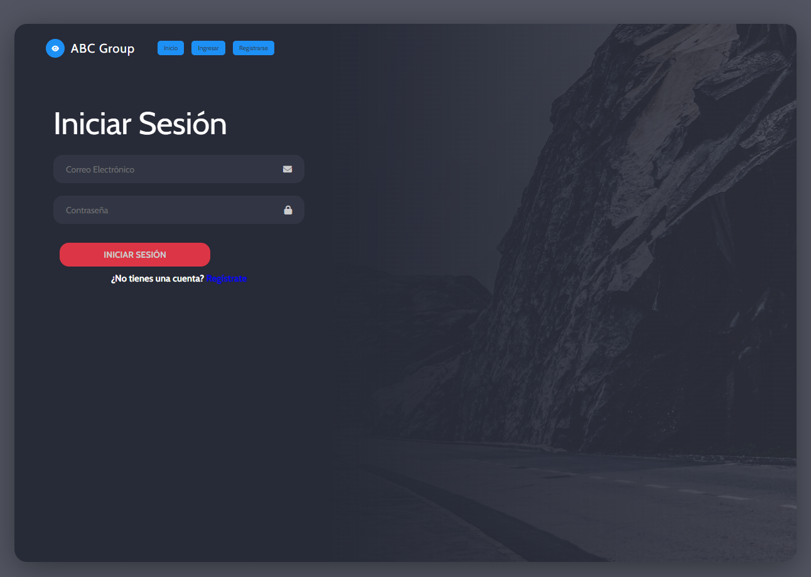
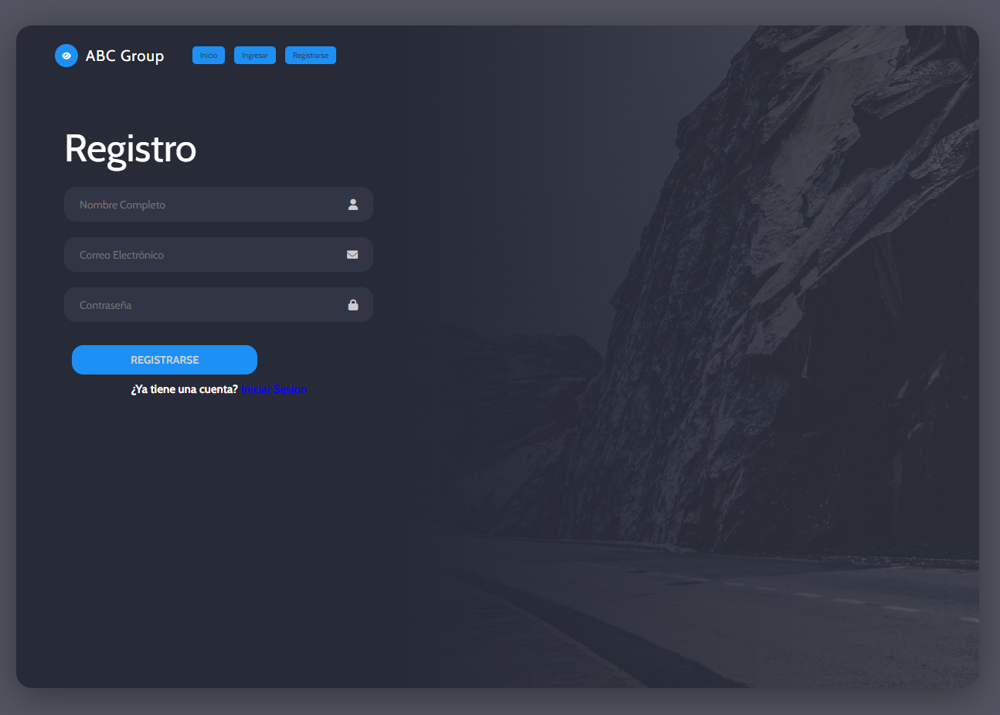
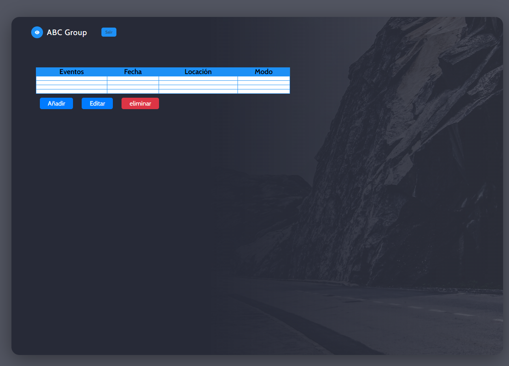

# Prueba Tecnica   Analista  junior a3Sec

- *Edward Fabian Goyeneche Velandia* - edwardfabianingenieria@gmail.com

# Documentación del Proyecto

## Tabla de Contenido

1. [Archivos Python](#archivos-python)
   - 1.1. [auth_routes.py](#auth_routespy)
   - 1.2. [events_routes.py](#events_routespy)
   - 1.3. [auth_services.py](#auth_servicespy)
   - 1.4. [db_services.py](#db_servicespy)

2. [Archivos de Configuración](#archivos-de-configuración)
   - 2.1. [utils.py](#utilspy)
   - 2.2. [app.py](#apppy)
   - 2.3. [extensions.py](#extensionspy)

3. [Archivos Docker](#archivos-docker)
   - 3.1. [Dockerfile](#dockerfile)
   - 3.2. [docker-compose.yml](#docker-composeyml)
4. [Demas Documentacion](#demas-documentacion)
    - [Funcionamiento y base de datos](app/README.md)
    - [routes](app/routes/README.md)
    - [services](app/services/README.md)
5. [Interfaz Web](#Interfaz-Web)
    - 5.1. [index](index)
    - 5.2. [login](login)
    - 5.3. [register](register)
    - 5.4. [event](event)

## 1. Archivos Python 

### 1.1. `auth_routes.py` 

Este archivo contiene las rutas relacionadas con la autenticación de usuarios.

- `register()`: Ruta para registrar un nuevo usuario.
- `login()`: Ruta para iniciar sesión.
- `logout()`: Ruta para cerrar sesión.
- `index()`: Ruta de inicio que redirige a la página de inicio de sesión o al panel de control.
- `home()`: Ruta de inicio que redirige a la página de inicio de sesión o al panel de control.

### 1.2. `events_routes.py` 

Este archivo contiene las rutas relacionadas con la gestión de eventos.

- `event()`: Ruta para mostrar los eventos de un usuario.
- `update_event()`: Ruta para actualizar un evento existente.
- `add_event()`: Ruta para añadir un nuevo evento.
- `delete_event()`: Ruta para eliminar un evento existente.

### 1.3. `auth_services.py` 

Este archivo contiene como se hace para generar y verificar tokens de autenticación utilizando JSON Web Tokens (JWT).

- `AuthService`: Clase para manejar la autenticación de usuarios.
    - `generate_token(user_id)`: Genera un token de autenticación para un usuario.
    - `decode_token(token)`: Decodifica un token de autenticación.
    - `verify_token(token)`: Verifica la validez de un token de autenticación.

### 1.4. `db_services.py` 

Este archivo contiene la forma para interactuar con la base de datos MySQL.

- `MySQLDatabase`: Clase para manejar las operaciones de la base de datos MySQL.
    - `register_user(name, email, password)`: Registra un nuevo usuario en la base de datos.
    - `authenticate_user(email, password)`: Autentica a un usuario en la base de datos.
    - `create_event(user_id, name, date, location, mode)`: Crea un nuevo evento en la base de datos.
    - `get_event(id)`: Obtiene un evento de la base de datos.
    - `add_event(user_id, name, date, location, mode)`: Añade un nuevo evento a la base de datos.
    - `delete_event(id)`: Elimina un evento de la base de datos.
    - `update_event(id, user_id, name, date, location, mode)`: Actualiza un evento en la base de datos.
    - `get_user_events(user_id)`: Obtiene todos los eventos de un usuario de la base de datos.

## 2. Archivos de Configuración 

### 2.1. `utils.py` 

Este archivo contiene funciones de utilidad y un decorador para requerir token de autenticación en las rutas.

- `token_required()`: Decorador para requerir un token de autenticación en las rutas.

### 2.2. `app.py` 

Este archivo es el punto de entrada principal de la aplicación Flask y registra los blueprints de las rutas de autenticación y eventos.

### 2.3. `extensions.py` 

Este archivo configura la aplicación Flask, la base de datos MySQL y el servicio de autenticación.

## 3. Archivos Docker 

### 3.1. `Dockerfile` 

Este archivo describe cómo construir la imagen del contenedor Docker para la aplicación.

### 3.2. `docker-compose.yml` 

Este archivo dtiene   los  servicios en contenedores Docker, incluyendo la aplicación web y la base de datos MySQL.

## 3.  Interfaz Web 
### 3.1. Inicio 

### 3.2. login 

### 3.3. register 

### 3.1. event 

