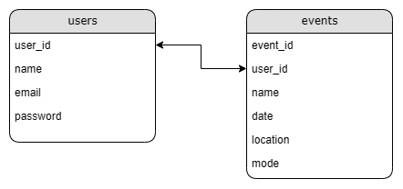
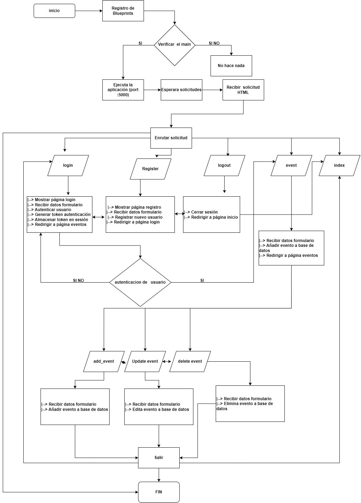

### Base de datos: events_abc_db

#### Herramienta de gestión: phpMyAdmin

#### Tablas:

1. **users**
   - **user_id** (int): Identificador único del usuario. Clave primaria.
   - **name** (varchar): Nombre del usuario.
   - **email** (varchar): Correo electrónico del usuario.
   - **password** (varchar): Contraseña del usuario.

```sql
CREATE TABLE users (
    user_id INT AUTO_INCREMENT PRIMARY KEY,
    name VARCHAR(255),
    email VARCHAR(255),
    password VARCHAR(255)
);
```

2. **events**
   - **event_id** (int): Identificador único del evento. Clave primaria.
   - **user_id** (int): Identificador del usuario asociado al evento.
   - **name** (varchar): Nombre del evento.
   - **date** (date): Fecha del evento.
   - **location** (varchar): Ubicación del evento.
   - **mode** (varchar): Modo del evento (posiblemente un tipo de evento).

```sql
CREATE TABLE events (
    event_id INT AUTO_INCREMENT PRIMARY KEY,
    user_id INT,
    name VARCHAR(255),
    date DATE,
    location VARCHAR(255),
    mode VARCHAR(255),
    FOREIGN KEY (user_id) REFERENCES users(user_id)
);
```

#### Relaciones:

- La tabla **users** tiene una relación uno a muchos con la tabla **events**, ya que un usuario puede crear o participar en múltiples eventos, pero un evento está asociado a un solo usuario.
- La clave extranjera en la tabla **events** es **user_id**, que referencia al **user_id** en la tabla **users**.



#### Notas adicionales:

- la configuracion es local, pero cambiadno los parametos de puerto y root de puede ejecutar donde se haga el despliegue.
- 





## Diagrama de flujo

**Iniciar aplicación**

**Explicación:**

* El flujo comienza con el **inicio de la aplicación**.
* Se **registran los blueprints**.
* Se **verifica si el archivo es el principal**. Si lo es, se **ejecuta la aplicación en modo de depuración en el puerto 5000**. Si no lo es, no se hace nada.
* La aplicación **espera solicitudes de usuarios**.
* Al recibir una **solicitud HTTP**, se **enruta** según la ruta de la solicitud:
    * **Registro (/register/)**:
        * Se muestra la **página de registro**.
        * Se reciben los **datos del formulario**.
        * Se **registra un nuevo usuario**.
        * Se **redirige a la página de inicio de sesión**.
    * **Inicio de sesión (/login/)**:
        * Se muestra la **página de inicio de sesión**.
        * Se reciben los **datos del formulario**.
        * Se **autentica al usuario**.
        * Se **genera un token de autenticación**.
        * Se **almacena el token en la sesión**.
        * Se **redirige a la página de eventos**.
    * **Cerrar sesión (/logout/)**:
        * Se **cierra la sesión**.
        * Se **redirige a la página de inicio**.
    * **Eventos (/event/)**:
        * Se **muestran los eventos del usuario**.
        * Si el **usuario está autenticado**:
            * Se **obtienen los eventos del usuario**.
            * Se **muestran los eventos en la página**.
        